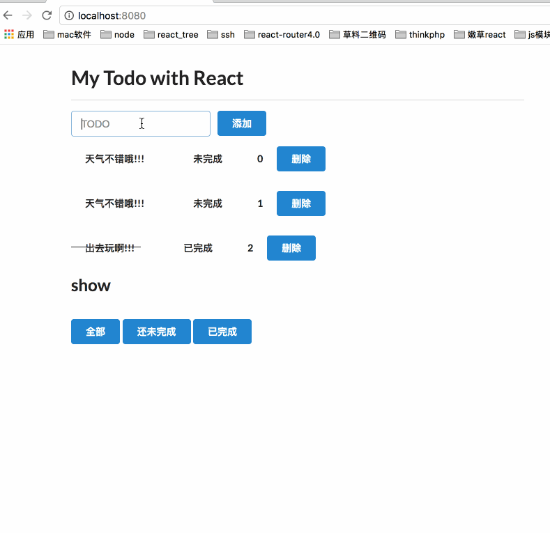

# 前端考核说明

本次考核采用 TypeScript 结合 React 框架进行编码，样式语言采用Sass,部分组件由 AntD 提供，代码提交采用git;考核内容主要为**代码规范编写、组件设计和git提交规范**等。

## 软件要求

|序号|名称|版本|备注|
|:----:|:----|----:|:----|
|1|Node|10^||
|2|yarn|latest|不能使用npm|
|3|git|latest|配合华为云，使用ssh连接|

## 操作说明

**从master拉去代码，创建自己得分支，分支命名规则为feature/全名，如feature/guzhongren,推送自己的分支到远程仓库，个人所有开发任务都在自己的分支中进行并提交**

## 目录说明

<pre>
  <code>
    |-CheckBase
      |-public 存放静态页面
      |-src 代码编写目录
        |-@types TypeScript定义目录
        |-api 请求封装目录，需要将图书管理的请求封装
        |-assets 网站静态资源存放目录，如字体
        |-components 组件编写目录
        |-layouts 页面布局面目录，包含Header，Body 和 Footer
        |-pages 页面内容具体目录
        |-utils 封装了axios的工具库
        |-index.scss css编写根目录
        |-index.tsx 组件加载根目录
        |-theme.scss 全局样式目录
      |- ... 其他目录
  </code>
</pre>

## 数据说明

> **api调用方式请参考 Demo 组件中请求**

### TodoList

> 自己设计数据结构

### BookManagement

> 请求为 restful 风格的地址，已在Webpack中做了代理。

|请求方式|请求路径|请求参数|请求描述|
|:--:|:--|:--|:--|
|GET|’booksAPI/books‘||获取所有书籍|
|GET|’booksAPI/books/book_id‘||获取id为book_id的书籍的详情|
|GET|’booksAPI/books/add‘|{name: string,content: string,labels: string,author: string}|新增书籍|
|GET|’booksAPI/books/book_id/delete‘||删除 id 为 book_id的书籍|

## 题目

### 1. TodoList (40’)

效果如下：

### 要求

  1. 不要求完全一致，实现功能即可;
  2. 数据结构自己Mock;
  3. 功能必须完善。

### 2. BookManagement(60')

> 无效果图

### 要求

1. 先完成展示所有书籍，然后完成添加书籍，最后完成别的功能;
2. 可以查看书籍详情
3. 组件结构需清晰
4. 界面需清晰美观明了

## 评分原则

1. 功能完整性
2. 界面美观度
3. 编码规范
4. 各项git操作
5. 其他创新